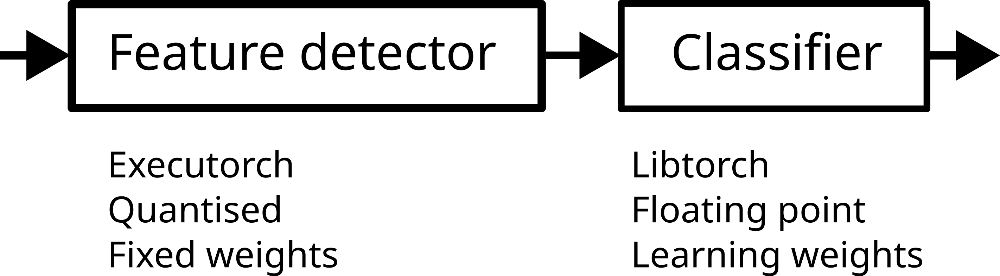
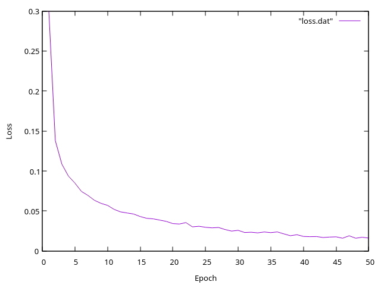

# Mobilenet V2 transfer learning with [executorch](https://github.com/pytorch/executorch) (and libtorch)


MobilenetV2 consists of a feature detector which in turn consists of a chain of inverted residuals. Then the actual classifier is just a single layer. Turns out that the trained features are pretty much universal. This comes handy in transfer learning where only the classifier layer needs to be re-trained. The parameters of the feature layers can stay frozen. Clearly, 90% of all the compute happens in the feature layers which is complex and takes up a lot of CPU time. Executorch is ideal as it's a lot faster than libtorch and has optimised integer operations.

 - Feature layers: quatised, fixed parameters in [executorch](https://github.com/pytorch/executorch)
 - Classifier layer: floating point, parameters learn via gradient descent in [libtorch](https://pytorch.org/get-started/locally/).
 
This is work in progress as I aim to do the learning also with executorch but for now learning in the final layer is done by libtorch.

## Install executorch

This installs both the executorch python package and the C++ static libraries.
If the python package install eventually fails then do `pip install executorch` instead but you need to run `install_executorch.py` as it also pulls in all the C++ dependencies.

```
git clone https://github.com/pytorch/executorch
cd executorch
git checkout v1.1.0
source ~/venv/bin/activate
python install_executorch.py
```

Ubuntu LTS: edit `CMakeLists.txt` and change to `cmake_minimum_required(VERSION 3.28)`.

```
cmake --preset linux -DCMAKE_BUILD_TYPE=Release -DCMAKE_INSTALL_PREFIX=/usr/local -DEXECUTORCH_BUILD_EXTENSION_TRAINING=ON .
cd cmake-out
make
sudo make install
```

## Install libtorch

 - Intel architectures: Get libtorch from the PyTorch homepage. Create an environment variable CMAKE_PREFIX_PATH=/path/to/libtorch pointing to the libtorch directory.
 - ARM Debian (Raspberry PI): just do apt install libtorch-dev and you are all set!

## Compile the transfer learning C++ code

```
cmake .
make
```

## Quantise the Mobilenet V2 model

```
python quantise.py
```

## Do transfer learning


It learns to classify Cats and Dogs. 
Get the Cats and Dogs from Kaggle with:

```
python get_cats_dogs.py
```

which downloads the files into kaggle's cache.

Run:
```
./transfer
```

to learn to distingusih between cats and dogs!

The file `loss.dat` contains the loss:



# Credit

Bernd Porr
